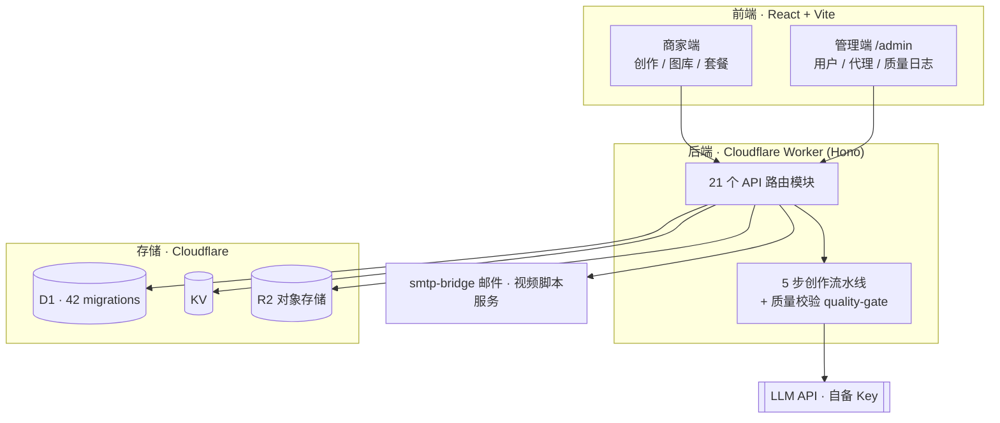

# 小红薯助手 · Xiaohongshu Merchant Assistant

> 一套帮线下商家批量生产小红书笔记 / 配图 / 视频脚本的 **AI 内容系统**。
> 本仓库是**架构介绍页**——完整源码通过**商业授权**交付，**非开源**。
>
> An AI content system that helps local merchants produce Xiaohongshu (RED) notes, images and video scripts at scale.
> This repo is a **public architecture overview** — the full source ships under a **commercial license**, not open source.

中文为主，English summary at the bottom.

---

## 这是什么 / What it is

做线下商家代运营时，手写一篇能用的小红书笔记要一个多小时——选题、文案、配图、排版，量一上来根本扛不住。于是我把整套创作流程写成了系统：商家填店铺信息，一条创作流水线自动出笔记、配图和视频脚本。线上跑了一段时间、打磨稳定后，整理成了可交付的源码包。

不是网上几十块的单页 Demo，是已经接通付费、多店、代理分销、创作流水线的**整合版**。

## 架构 / Architecture

## 核心能力 / Modules

- 商家端：AI 写笔记（5 步创作流水线 + 质量校验）、图库、视频脚本
- 业务：套餐配额、邀请、代理分销、轻量 CRM、多店管理
- 管理端：用户管理、代理管理、邀请码、质量日志
- 内容引擎：7 大行业 × 116 子分类，质量校验层专治 AI「假大空」

## 它凭什么不是玩具 / Why it's not a toy

最难的不是堆功能，而是**让 AI 别写那种假大空的文案**——专门加了一层质量校验，在草稿到达商家之前重写/拦截低质内容。付费、多店、代理层级都接进了真实流程，不是占位。

## 适合谁 / Who should license it

- 会 Cloudflare 部署的技术创业者 / 独立开发者
- 小红书代运营、本地生活团队，想自建平台、贴牌运营
- 需要一个可改名的商业底座，自己对接 AI Key 与收款

**不适合**：完全不懂部署、期望买来一键躺赚的纯商家。

## 授权交付 / Commercial License

一次性源码授权（非订阅、非独家、禁止转售）：

- 脱敏完整源码（worker + pages + smtp-bridge + 视频服务）
- 部署文档（DEPLOY_RUNBOOK）+ 功能模块索引 + 授权协议
- 买方自备：Cloudflare 账号、域名、LLM API Key

**不含**：卖方客户数据、品牌/域名、API 余额、长期更新。

## FAQ

**Q：和闲鱼几十块的源码有什么区别？**
A：那些多是单页 Demo。这是已跑通的整合版，含付费 / 多店 / 代理 / 创作流水线。

**Q：纯商家能买吗？**
A：不建议。不会部署会很痛苦，纯商家更适合用 SaaS 订阅。

**Q：能改成自己的品牌吗？**
A：可以，这本来就是给团队当商业底座用的。

## 咨询 / Contact

想了解交付清单、演示或授权细节，请在本仓库 **提一个 Issue**，或通过我各平台主页私信。架构问题也欢迎公开交流。

---

## English summary

An AI content system for Xiaohongshu (RED) merchants: AI note creation (5-step pipeline with a quality gate), image library, video scripts, plans, referrals, agent distribution, multi-store, and an admin panel. Stack: **React + Vite** frontend, **Cloudflare Workers (Hono)** backend, **D1 (42 migrations) + KV + R2** storage, with smtp-bridge and a video-script sidecar.

This is an **architecture overview** — the full sanitized source, deploy runbook and a non-exclusive license are delivered as a **one-time commercial package**. Buyer brings their own Cloudflare account, domain and LLM keys. Open an issue to discuss licensing.
